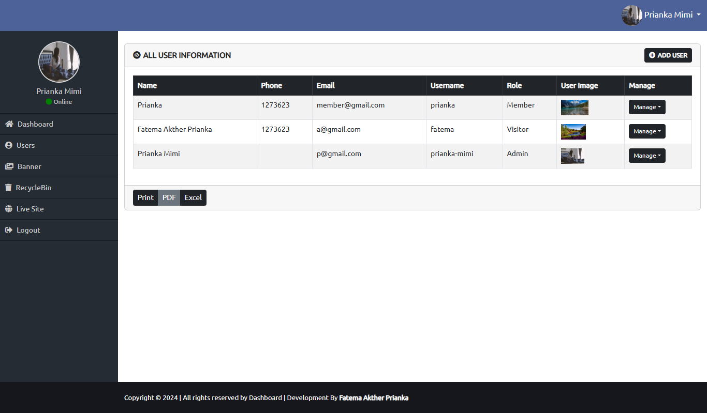
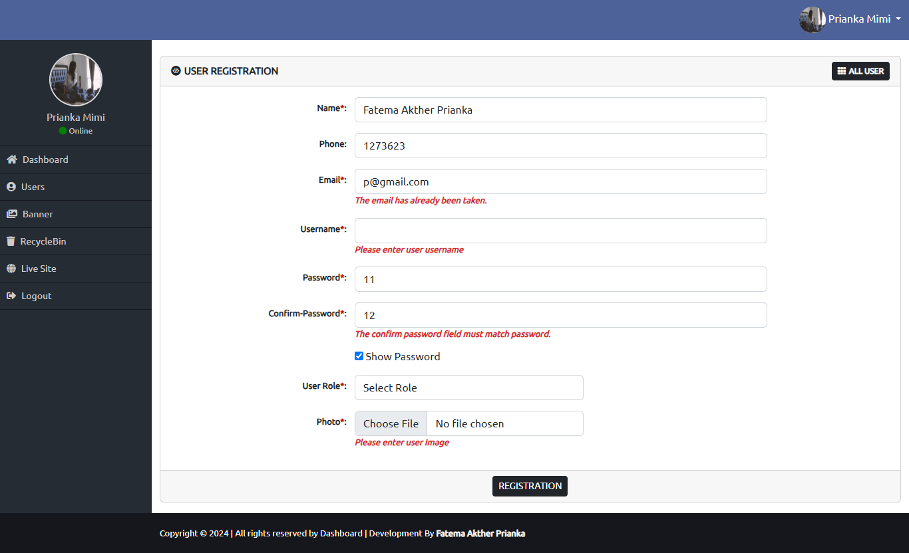
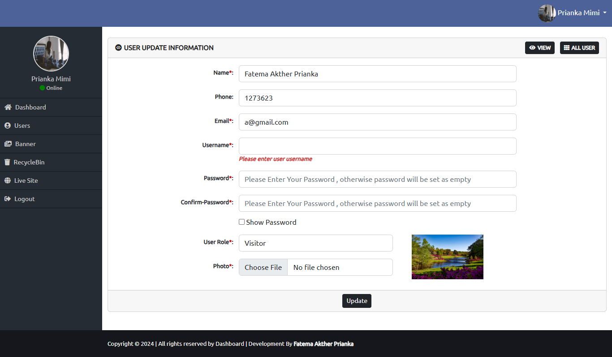
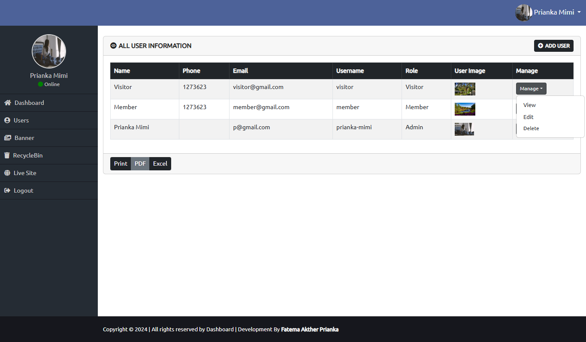
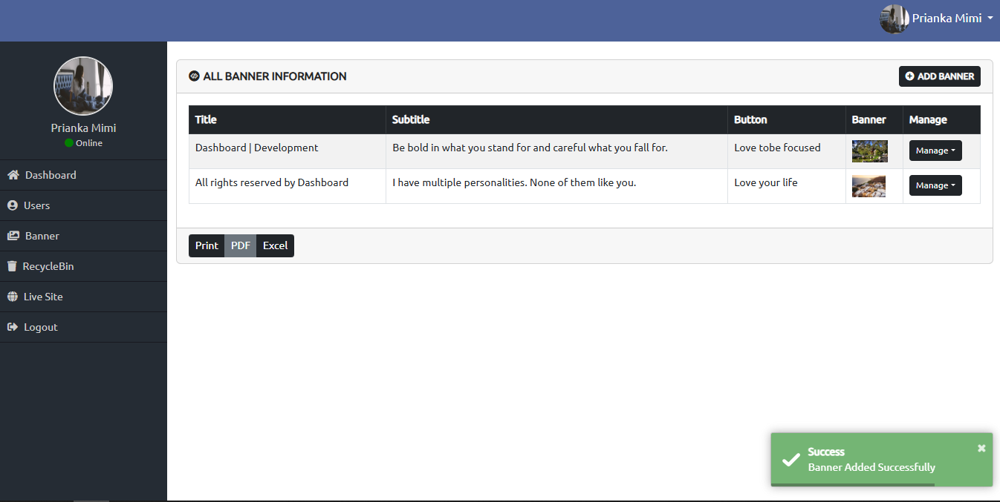

# Admin Panel Laravel CRUD in Breeze !

It's a simple **Admin Panel Laravel CRUD ** multi page project **With Breeze** can...
 - User | Banner
    - Add
    - View
    - Edit 
    - Delete
 - User Role - Assign | Edit
 - Restore User | Banner data or can permanently delete from database
 - Login with email and password
 - LogOut

## Author

[Fatema Akther Prianka 🤗](https://github.com/Prianka-Mimi)

## Features

- Add | View | Edit | Delete | Restore - User | Banner

- Validations - User | Banner

- Uses of slug | Creator Name & Time | Editor Name & Time - User | Banner

- Single view page with slug - User | Banner

- Unable to Edit in RecycleBin - User | Banner

- Assign Role to User | Edit Role User

- Default User Role Visitor (3) - If Role Not Selected

- Uses of Middleware for which Role | Roles - can Access what or not

- Pagination using Bootstrap - User | Banner

- Uses of Seeder for Role and BackUp User Information

- Logout ( Custom designed Sidebar ) work through default breeze system

- Uses of Breeze for Authentication and Authorization | Login with email and password

- Image upload without any laravel package

## Has Been Used

 - Html
 - Css
 - Bootstrap
 - JavaScript
   - JQuery (Password Toggle User)

## View In Short

**Dashboard**

**All User**

**Add User**

> Add User with Validation

> Default Role Visitor (3) - If Role Not Selected

**View User**

> View User with Edit & SoftDelete Button

**Edit User**

> Role changeable | Can Edit

**User | Banner - Manage Button**

**Role - Member View & Permissions**

**Role - Visitor View & Permissions**

**All Banner**

> All Banner after adding a banner

**Add Banner**

> Add Banner with Validation

**View Banner**

> View Banner with Edit & SoftDelete Button

**Edit Banner**

**RecycleBin**

> All - User | Banner - RecycleBin with Pagination

**RecycleBin Manage Button**

**Restore**

> All User (also in Banner) View with Restore & Permanent Delete Button

  
## Contact

[🌐 Fatema Akther Prianka](https://webdeveloperprianka.netlify.app/)

[Linkedin](https://www.linkedin.com/in/fatema-akther-prianka/)

[FaceBook](https://www.facebook.com/fatemaaktherprianka.webdeveloper)

[Stack Overflow](https://stackoverflow.com/users/23182049/prianka-mimi)
